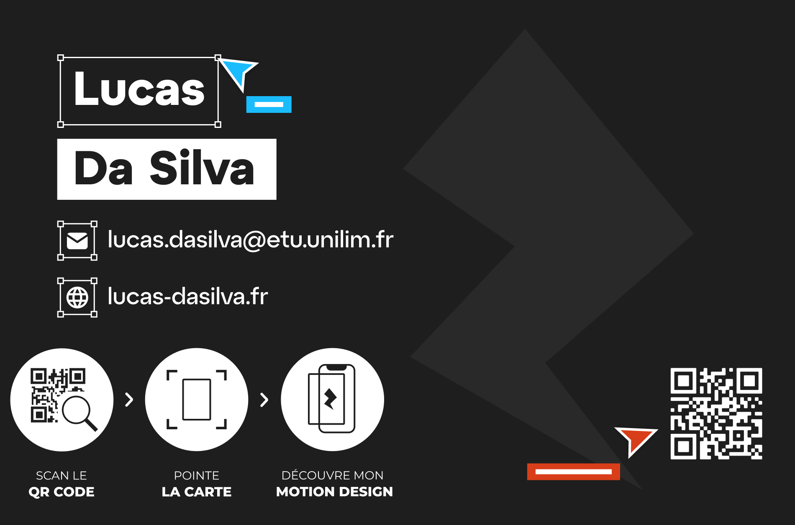

Sujet - Faites vivre une expérience intéractive à votre carte de visite avec la réalité augmentée.
La carte de visite, traditionnellement utilisée comme un outil statique pour partager des informations professionnelles, peut aujourd'hui être transformée en une expérience interactive et immersive grâce à la réalité augmentée (RA).

## Mise en intrigue

Quelle compétence souhaitez-vous mettre en avant ?
J'ai souhaité mettre en avant mes compétences de création graphique, de motion design et de webdesign en représentant l'interface du logiciel Figma.
Je représente à travers ce motion design la création, l'imagination et la collaboration / le travail d'équipe

Quelle est votre entreprise cible ?
L'entreprise que j'ai choisi de cibler est 3310 Street. celle dans laquelle je réalise actuellement mon alternance.

Trouver un slogan en déduire un concept, une bonne idée.
Mon slogan : D'une idée créons ensemble

#C'est parti

Scannez ce QR Code pour démarrer

Acceptez les demandes d'accès à la caméra puis scannez ma carte de visite pour que la magie opère.

